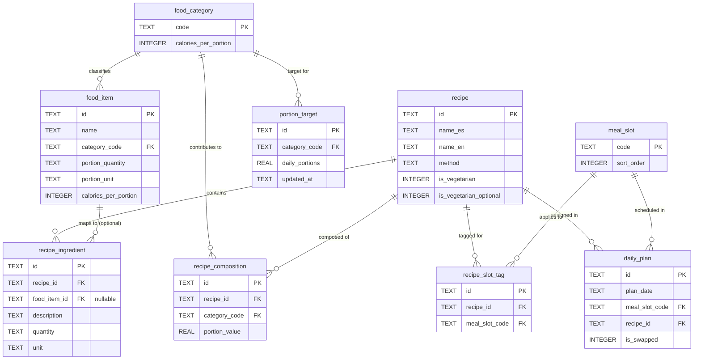

# Data Schema — Nutrition App MVP1 (SQLite)

> Derived from: Domain Model (mvp1-domain-model.md) · Target: expo-sqlite · Local-only, offline-first

-----

## 1. Design Principles

- **Portions primary, calories derived** — no `calories` column stores a user-facing total; only `caloriesPerPortion` (a fixed constant) exists per category.
- **Seed tables are read-only at runtime** — `food_item`, `recipe`, `recipe_ingredient`, `recipe_composition`, `recipe_slot_tag` are populated once from bundled JSON; no INSERT/UPDATE/DELETE from app UI in MVP1.
- **`portion_target` is the only user-mutable table** (besides `daily_plan`).
- **Enums as TEXT + CHECK constraints** — SQLite has no native enum type; `CHECK` enforces valid values at the DB layer.
- **IDs**: TEXT (UUID) for seed-data portability across app versions; avoids collision risk when seed data is re-imported on updates.

-----

## 2. Schema DDL

```sql
-- /db/schema.sql

-- ============================================
-- Reference table: FoodCategory constants
-- ============================================
CREATE TABLE food_category (
    code TEXT PRIMARY KEY CHECK (code IN ('GRAIN','FRUIT','VEGETABLE','DAIRY','PROTEIN','FAT')),
    calories_per_portion INTEGER NOT NULL
);

-- Seed values (fixed, not user-editable)
INSERT INTO food_category (code, calories_per_portion) VALUES
    ('GRAIN', 80),
    ('FRUIT', 60),
    ('VEGETABLE', 25),
    ('DAIRY', 90),
    ('PROTEIN', 55),
    ('FAT', 45);

-- ============================================
-- Reference table: MealSlot constants
-- ============================================
CREATE TABLE meal_slot (
    code TEXT PRIMARY KEY CHECK (code IN ('BREAKFAST','MORNING_SNACK','LUNCH','AFTERNOON_SNACK','DINNER')),
    sort_order INTEGER NOT NULL
);

INSERT INTO meal_slot (code, sort_order) VALUES
    ('BREAKFAST', 1),
    ('MORNING_SNACK', 2),
    ('LUNCH', 3),
    ('AFTERNOON_SNACK', 4),
    ('DINNER', 5);

-- ============================================
-- FoodItem — exchange list seed data (~150 rows)
-- ============================================
CREATE TABLE food_item (
    id TEXT PRIMARY KEY,
    name TEXT NOT NULL,
    category_code TEXT NOT NULL REFERENCES food_category(code),
    portion_quantity TEXT NOT NULL,
    portion_unit TEXT NOT NULL,
    calories_per_portion INTEGER NOT NULL
);

CREATE INDEX idx_food_item_category ON food_item(category_code);
CREATE INDEX idx_food_item_name ON food_item(name);

-- ============================================
-- PortionTarget — user's active nutrition plan (6 rows, mutable)
-- ============================================
CREATE TABLE portion_target (
    id TEXT PRIMARY KEY,
    category_code TEXT NOT NULL UNIQUE REFERENCES food_category(code),
    daily_portions REAL NOT NULL CHECK (daily_portions >= 0),
    updated_at TEXT NOT NULL DEFAULT (datetime('now'))
);

-- ============================================
-- Recipe — catalog seed data (~24 rows)
-- ============================================
CREATE TABLE recipe (
    id TEXT PRIMARY KEY,
    name_es TEXT NOT NULL,
    name_en TEXT NOT NULL,
    method TEXT NOT NULL,
    is_vegetarian INTEGER NOT NULL DEFAULT 0 CHECK (is_vegetarian IN (0,1)),
    is_vegetarian_optional INTEGER NOT NULL DEFAULT 0 CHECK (is_vegetarian_optional IN (0,1))
);

CREATE INDEX idx_recipe_vegetarian ON recipe(is_vegetarian);

-- ============================================
-- RecipeIngredient — nullable FoodItem FK + free-text fallback
-- ============================================
CREATE TABLE recipe_ingredient (
    id TEXT PRIMARY KEY,
    recipe_id TEXT NOT NULL REFERENCES recipe(id) ON DELETE CASCADE,
    food_item_id TEXT REFERENCES food_item(id),  -- nullable: not all ingredients map to exchange list
    description TEXT NOT NULL,                    -- always present; display fallback (e.g., "Salsa Lizano")
    quantity TEXT NOT NULL,
    unit TEXT NOT NULL
);

CREATE INDEX idx_recipe_ingredient_recipe ON recipe_ingredient(recipe_id);
CREATE INDEX idx_recipe_ingredient_fooditem ON recipe_ingredient(food_item_id);

-- ============================================
-- RecipeComposition — portion breakdown per recipe
-- (beans dual-count = two rows, same recipe, GRAIN + PROTEIN)
-- ============================================
CREATE TABLE recipe_composition (
    id TEXT PRIMARY KEY,
    recipe_id TEXT NOT NULL REFERENCES recipe(id) ON DELETE CASCADE,
    category_code TEXT NOT NULL REFERENCES food_category(code),
    portion_value REAL NOT NULL CHECK (portion_value > 0),
    UNIQUE (recipe_id, category_code)  -- one row per category per recipe; sum contributions before insert
);

CREATE INDEX idx_recipe_composition_recipe ON recipe_composition(recipe_id);

-- ============================================
-- RecipeSlotTag — which meal slots a recipe applies to (multi-slot support)
-- ============================================
CREATE TABLE recipe_slot_tag (
    id TEXT PRIMARY KEY,
    recipe_id TEXT NOT NULL REFERENCES recipe(id) ON DELETE CASCADE,
    meal_slot_code TEXT NOT NULL REFERENCES meal_slot(code),
    UNIQUE (recipe_id, meal_slot_code)
);

CREATE INDEX idx_recipe_slot_tag_slot ON recipe_slot_tag(meal_slot_code);
CREATE INDEX idx_recipe_slot_tag_recipe ON recipe_slot_tag(recipe_id);

-- ============================================
-- DailyPlan — today's suggested/swapped recipe per slot
-- One row per (date, meal_slot); overwritten on swap or date change
-- ============================================
CREATE TABLE daily_plan (
    id TEXT PRIMARY KEY,
    plan_date TEXT NOT NULL,              -- ISO date, e.g. '2026-06-20'
    meal_slot_code TEXT NOT NULL REFERENCES meal_slot(code),
    recipe_id TEXT NOT NULL REFERENCES recipe(id),
    is_swapped INTEGER NOT NULL DEFAULT 0 CHECK (is_swapped IN (0,1)),
    UNIQUE (plan_date, meal_slot_code)
);

CREATE INDEX idx_daily_plan_date ON daily_plan(plan_date);
```

-----

## 3. Schema Diagram



-----

## 4. Key Query Patterns (MVP1 usage)

**Derive total daily calories from portion targets** (US-02):

```sql
SELECT SUM(pt.daily_portions * fc.calories_per_portion) AS total_daily_calories
FROM portion_target pt
JOIN food_category fc ON fc.code = pt.category_code;
```

**Suggest a recipe for a meal slot** (US-05 — non-strict, slot-only filter per Domain Rule 3):

```sql
SELECT r.* FROM recipe r
JOIN recipe_slot_tag rst ON rst.recipe_id = r.id
WHERE rst.meal_slot_code = :slot
ORDER BY RANDOM()
LIMIT 1;
```

**Get portion composition for a recipe card** (US-07):

```sql
SELECT category_code, portion_value
FROM recipe_composition
WHERE recipe_id = :recipeId;
```

**Get today's full plan** (US-04):

```sql
SELECT dp.meal_slot_code, r.name_es, r.id
FROM daily_plan dp
JOIN recipe r ON r.id = dp.recipe_id
WHERE dp.plan_date = :today
ORDER BY (SELECT sort_order FROM meal_slot WHERE code = dp.meal_slot_code);
```

**Food substitution lookup within category** (US-13):

```sql
SELECT * FROM food_item
WHERE category_code = (SELECT category_code FROM food_item WHERE id = :foodItemId)
AND id != :foodItemId;
```

-----

## 5. Migration / Versioning Note

- MVP1 ships schema as a single `schema.sql` run on first launch via `expo-sqlite`
- Seed data (food_item, recipe, recipe_ingredient, recipe_composition, recipe_slot_tag) loaded from bundled JSON immediately after table creation
- **`portion_target` and `daily_plan` must never be touched by app-update seed re-imports** — these are the only user-state tables; re-running seed scripts must be idempotent (`INSERT OR IGNORE` / check-before-insert) for reference tables only

-----

## 6. Open Items for Seed Data Phase

|Item                                                  |Decision needed                                                                                                                                                   |
|------------------------------------------------------|------------------------------------------------------------------------------------------------------------------------------------------------------------------|
|UUID generation strategy for seed IDs                 |Recommend deterministic slugs (e.g., `"gallo-pinto"`, `"grain-rice-white"`) over random UUIDs — easier to debug, human-readable in JSON                           |
|`recipe_composition` UNIQUE constraint                |Confirmed: one row per (recipe, category) — multi-contribution categories (e.g., rice contributing to GRAIN from two ingredients) must be pre-summed before insert|
|Default `portion_target` values for onboarding (US-14)|Still pending from earlier — needed to seed first-run defaults                                                                                                    |
