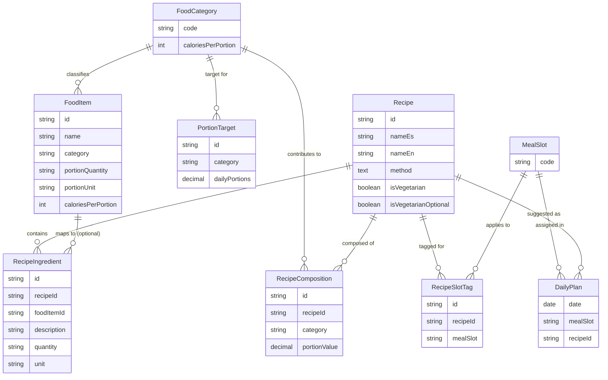
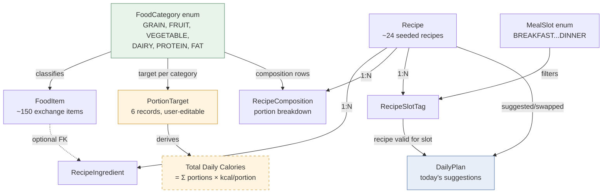

# Domain Model — Nutrition App MVP1

> Single user · Offline-first · Portion-exchange based · No meal logging

-----

## 1. Core Entities

### FoodCategory (enum)

The foundational classification — every other entity references this.

|Value      |Spanish label|Calories per portion|
|-----------|-------------|--------------------|
|`GRAIN`    |Harina       |80                  |
|`FRUIT`    |Fruta        |60                  |
|`VEGETABLE`|Vegetal      |25                  |
|`DAIRY`    |Lácteo       |90                  |
|`PROTEIN`  |Proteína     |55                  |
|`FAT`      |Grasa        |45                  |

-----

### FoodItem

Represents a single entry from the exchange list.

|Field               |Type        |Notes                                           |
|--------------------|------------|------------------------------------------------|
|`id`                |string/int  |PK                                              |
|`name`              |string      |Spanish (source data)                           |
|`category`          |FoodCategory|FK to enum                                      |
|`portionQuantity`   |string      |e.g., "1/3", "1"                                |
|`portionUnit`       |string      |e.g., "taza", "unidad"                          |
|`caloriesPerPortion`|int         |Denormalized from FoodCategory for display speed|

- Read-only in MVP1 (~150 seeded items)

-----

### PortionTarget

The user's current nutritionist-defined plan. Exactly **6 records**, one per FoodCategory.

|Field          |Type        |Notes                     |
|---------------|------------|--------------------------|
|`id`           |string/int  |PK                        |
|`category`     |FoodCategory|FK to enum, unique        |
|`dailyPortions`|decimal     |User/nutritionist editable|

- `totalDailyCalories` is **derived**, never stored:
  `Σ (dailyPortions × caloriesPerPortion)` across all 6 categories

-----

### Recipe

A catalog entry. Read-only seed data in MVP1 (~24 recipes).

|Field                 |Type      |Notes                                  |
|----------------------|----------|---------------------------------------|
|`id`                  |string/int|PK                                     |
|`nameEs`              |string    |Display name (Spanish)                 |
|`nameEn`              |string    |Reference/dev name (English)           |
|`method`              |text      |Preparation steps                      |
|`isVegetarian`        |boolean   |                                       |
|`isVegetarianOptional`|boolean   |True if vegetarian when meat is omitted|

-----

### RecipeIngredient

Ingredients belonging to a recipe.

|Field        |Type                       |Notes                                                                  |
|-------------|---------------------------|-----------------------------------------------------------------------|
|`id`         |string/int                 |PK                                                                     |
|`recipeId`   |FK → Recipe                |                                                                       |
|`foodItemId` |FK → FoodItem, **nullable**|Null if ingredient isn't in exchange list (e.g., Salsa Lizano, achiote)|
|`description`|string                     |Free text, always present (display fallback)                           |
|`quantity`   |string                     |e.g., "½"                                                              |
|`unit`       |string                     |e.g., "taza"                                                           |

-----

### RecipeComposition

The portion breakdown of a recipe (e.g., "2 Grains + 3 Proteins + 1 Vegetable").

|Field         |Type        |Notes                        |
|--------------|------------|-----------------------------|
|`id`          |string/int  |PK                           |
|`recipeId`    |FK → Recipe |                             |
|`category`    |FoodCategory|FK to enum                   |
|`portionValue`|decimal     |Can be fractional (e.g., 0.5)|

- One row **per category** the recipe contributes to
- A recipe can have multiple rows — e.g., beans → one `GRAIN` row + one `PROTEIN` row (see Domain Rules)

-----

### MealSlot (enum)

|Value            |Spanish reference|
|-----------------|-----------------|
|`BREAKFAST`      |Desayuno         |
|`MORNING_SNACK`  |Merienda AM      |
|`LUNCH`          |Almuerzo         |
|`AFTERNOON_SNACK`|Merienda PM      |
|`DINNER`         |Cena             |

-----

### RecipeSlotTag

Links a recipe to one or more meal slots (supports multi-slot recipes like Gallo Pinto).

|Field     |Type       |Notes     |
|----------|-----------|----------|
|`id`      |string/int |PK        |
|`recipeId`|FK → Recipe|          |
|`mealSlot`|MealSlot   |FK to enum|

-----

### DailyPlan

Today's suggested/swapped recipe per slot. Single active record, no history in MVP1.

|Field            |Type                   |Notes                                              |
|-----------------|-----------------------|---------------------------------------------------|
|`date`           |date                   |PK (one record per day; overwritten on date change)|
|`slotAssignments`|Map<MealSlot, recipeId>|Stored as 5 rows or JSON blob                      |

-----

## 2. Entity Relationship Diagram



-----

## 3. Relationship Overview Diagram (simplified flow)



-----

## 4. Domain Rules — Detailed

### Rule 1: Beans Dual-Count

**What it means**: Standard exchange-list convention — ½ cup cooked beans simultaneously counts as **1 Grain exchange AND 1 Protein exchange**. This is not an approximation; it reflects beans' actual macro profile (carbs + protein).

**How it's modeled**: NOT as special-case code. A recipe containing beans (e.g., Gallo Pinto) gets **two separate `RecipeComposition` rows**:

```
RecipeComposition { recipeId: "gallo-pinto", category: GRAIN,   portionValue: 1 }
RecipeComposition { recipeId: "gallo-pinto", category: PROTEIN, portionValue: 1 }
```

**Why this matters**: If this rule is skipped, every bean-based dish (the backbone of Costa Rican cuisine — gallo pinto, casado, sopa negra) will under-report protein content by ~1 full exchange. The data model handles this naturally because `RecipeComposition` already supports multiple rows per recipe — no conditional logic needed in application code.

-----

### Rule 2: Calories Are Always Derived, Never Stored as Input

**What it means**: The user never directly sets "I want 1500 calories." They set portion targets per category (e.g., 5 Grains, 13 Proteins…). Calories are a **read-only, computed display value**.

**Formula**:

```
totalDailyCalories = Σ over all 6 categories (dailyPortions[category] × caloriesPerPortion[category])
```

**Why this matters**:

- Prevents data inconsistency — there's no scenario where "stored calories" and "stored portions" disagree
- Matches how nutritionists actually communicate plans (portion-based, not calorie-based)
- If `PortionTarget` changes (US-03), the calorie display updates automatically with zero additional persistence logic
- Future MVPs that add calorie-based features (e.g., weekly summaries) compute from the same single source of truth

-----

### Rule 3: Recipe Matching Is Non-Strict in MVP1

**What it means**: `RecipeSlotTag` (meal slot: breakfast/lunch/etc.) is the **only filter** used to suggest recipes. `RecipeComposition` (the portion breakdown) is **informational only** — it is displayed to the user but does NOT constrain which recipes can be suggested or swapped.

**Why this matters**:

- Keeps MVP1 suggestion logic trivial: `SELECT recipes WHERE slotTag = :currentSlot`
- Avoids building a constraint-satisfaction/recommendation engine prematurely (this was flagged as a major scope risk in initial analysis)
- `RecipeComposition` data is still captured now so that **MVP2+ can add portion-aware filtering later without re-modeling** — the data exists, only the query logic needs to change

-----

### Rule 4: FoodItem and Recipe Are Immutable Seed Data

**What it means**: In MVP1, there is no create/edit/delete UI for food items or recipes. Both tables are populated once at first launch from bundled JSON and never modified by the user.

**Why this matters**:

- Eliminates an entire class of data-validation and sync concerns for MVP1
- `PortionTarget` is the **only** user-mutable nutritional configuration — keeps the mutable surface area small and well-defined
- **Risk flagged for future MVPs**: if user-editable recipes/food items are introduced later, this will require versioning or a "custom vs. seed" distinction to avoid overwriting user data on app updates that refresh seed data

-----

## 5. Open Items Carried to Schema Phase

|Item                                           |Recommendation                                                                                        |Status              |
|-----------------------------------------------|------------------------------------------------------------------------------------------------------|--------------------|
|`RecipeIngredient.foodItemId` nullability      |Nullable + free-text `description` fallback for non-exchange ingredients (Salsa Lizano, achiote, etc.)|Pending confirmation|
|`DailyPlan` persistence across same-day reopens|Persist in SQLite as a single row per date, overwrite on date change                                  |Recommended default |
|ID strategy (UUID vs autoincrement)            |Low risk for local SQLite — defer to schema phase                                                     |Open                |
