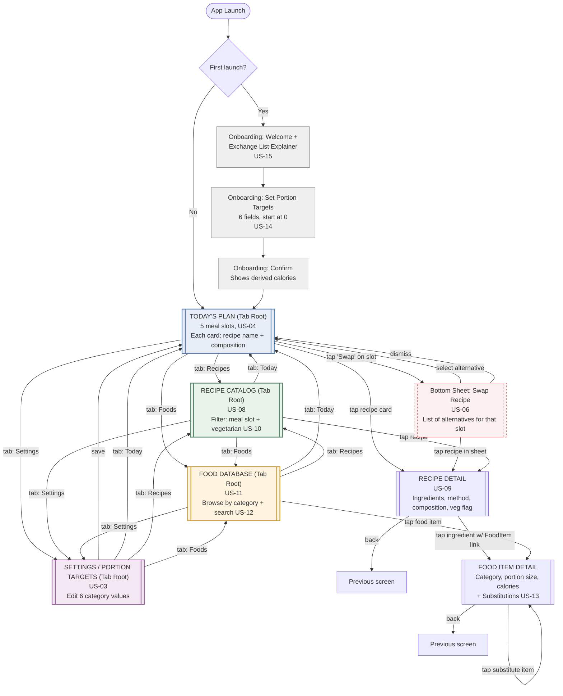

# Screen Flow / UX Map — Nutrition App MVP1

> Navigation: bottom tab bar (4 tabs) · Swap interaction: bottom sheet · Derived from User Stories + Domain Model

-----

## 1. Navigation Structure

**Bottom Tab Bar (persistent, 4 tabs):**

|Tab     |Icon (suggested)|Root screen    |
|--------|----------------|---------------|
|Today   |calendar/home   |Today's Plan   |
|Recipes |book            |Recipe Catalog |
|Foods   |list            |Food Database  |
|Settings|gear            |Portion Targets|

**Top bar per screen:**

|Screen          |Top bar content                                  |
|----------------|-------------------------------------------------|
|Today's Plan    |App name (left) · Today's date (right) · no back |
|Recipe Catalog  |"Recipes" title · filter icon (vegetarian toggle)|
|Recipe Detail   |back arrow · recipe name                         |
|Food Database   |"Food Database" title · search icon              |
|Food Item Detail|back arrow · food item name                      |
|Settings        |"Settings" title · no back (tab root)            |
|Onboarding      |no back · step indicator · no skip               |

-----

## 2. Full Screen Flow

-----

## 3. Key Screen Details

### Today's Plan (Home / Tab Root)

- **Purpose**: primary daily view — satisfies "very simple to use" (US-04, US-05)
- **Layout**: vertically scrollable list of 5 meal slot cards
- **Per card**: meal slot label + time reference, recipe name, compact portion composition (e.g., "2 Grains · 3 Proteins · 1 Vegetable"), "Swap" action
- **Tap target**: tapping the card body → Recipe Detail; tapping "Swap" → bottom sheet
- **Empty/edge case**: if no recipe exists for a slot (data gap), show "No suggestion available" — never a blank card

### Swap Bottom Sheet (US-06)

- **Trigger**: "Swap" tap on any Today's Plan card
- **Content**: scrollable list of all recipes tagged for that meal slot, each row showing name + composition
- **Interaction**: tap a row → assigns to slot, closes sheet, returns to Today's Plan (now updated)
- **Tap budget check**: Today → Swap (1) → Select alternative (2) = **2 taps**, under the 3-tap requirement from US-06

### Recipe Catalog (Tab Root)

- **Purpose**: full browse/explore (US-08)
- **Layout**: filterable list/grid, filter bar at top (meal slot chips + vegetarian toggle)
- **Per item**: same card format as Today's Plan for consistency

### Recipe Detail

- **Purpose**: full recipe info (US-09)
- **Sections**: title, vegetarian badge, portion composition, ingredients (linked to Food Item where available), method steps
- **Reachable from**: Today's Plan, Swap Sheet, Recipe Catalog — single shared screen, no duplication

### Food Database (Tab Root)

- **Purpose**: browse exchange list (US-11, US-12)
- **Layout**: grouped by category (6 sections) with search bar
- **Per item**: name, portion quantity/unit, calories

### Food Item Detail

- **Purpose**: single item + substitutions (US-13)
- **Sections**: name, category, portion size, calories, "Other options in this category" list

### Settings / Portion Targets (Tab Root)

- **Purpose**: edit nutritionist plan (US-03)
- **Layout**: 6 numeric inputs (one per category), live-updating derived calorie total at top
- **Save behavior**: explicit save action, confirmation feedback, returns to Today's Plan (reflects new targets immediately per US-03)

### Onboarding (first launch only)

- **Step 1**: welcome + brief exchange list explainer (US-15) — 1 screen, dismissible
- **Step 2**: portion target entry — same UI pattern as Settings, but fields start at 0 (no pre-fill)
- **Step 3**: confirmation showing derived calories, single "Get Started" action → Today's Plan
- **No skip option** — confirmed in prior decision

-----

## 4. UX Constraints Validated Against User Stories

|Constraint                                 |Source|Validated by flow                    |
|-------------------------------------------|------|-------------------------------------|
|Max 3 taps to swap a recipe                |US-06 |2 taps (Swap → Select)               |
|Max 2 taps from daily plan to recipe detail|US-09 |1 tap (card → detail)                |
|Onboarding under 2 minutes                 |US-14 |3 short steps, numeric entry only    |
|Food search results <1 second              |US-12 |Local SQLite, indexed — no network   |
|All 5 meal slots visible on one screen     |US-04 |Single scrollable list, no pagination|

-----

## 5. Open Items for Development Phase

|Item                                                    |Note                                                                                    |
|--------------------------------------------------------|----------------------------------------------------------------------------------------|
|Recipe card visual design (image vs. text-only)         |No recipe images sourced yet — text-only for MVP1, image field reserved in future schema|
|Empty-state copy (no recipe for slot, no search results)|Needs final copywriting pass before dev                                                 |
|Settings save UX (toast vs. inline confirmation)        |Defer to frontend-design phase                                                          |
